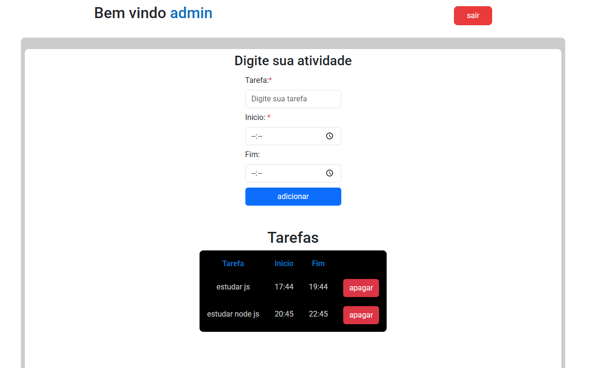

# Sistema de Cadastro e Login

## Detalhes 
Projeto de cadastro e login desenvolvido em JavaScript, utilizando o localStorage para persistência de dados no navegador. O sistema permite criar uma conta, salvar as informações localmente e realizar autenticação comparando os dados informados no login com os dados previamente cadastrados. Após a validação correta, o usuário é redirecionado para uma página restrita onde poderar estar gerenciando criaçoes de atividades.

## Funcionalidades
- Cadastro de usuário
- Armazenamento de dados no localStorage
- Login com validação de credenciais
- Controle de acesso a página restrita
